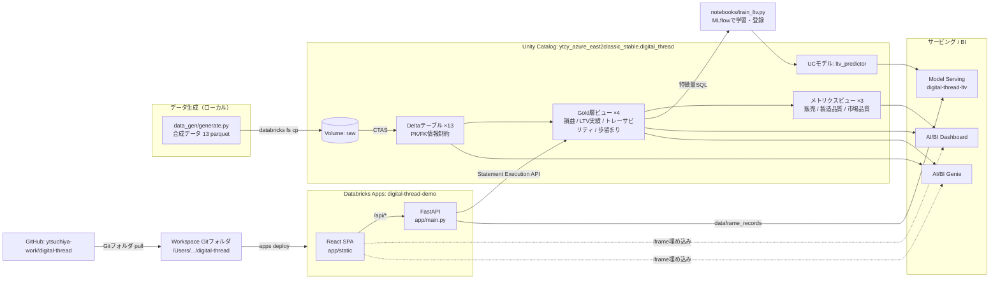
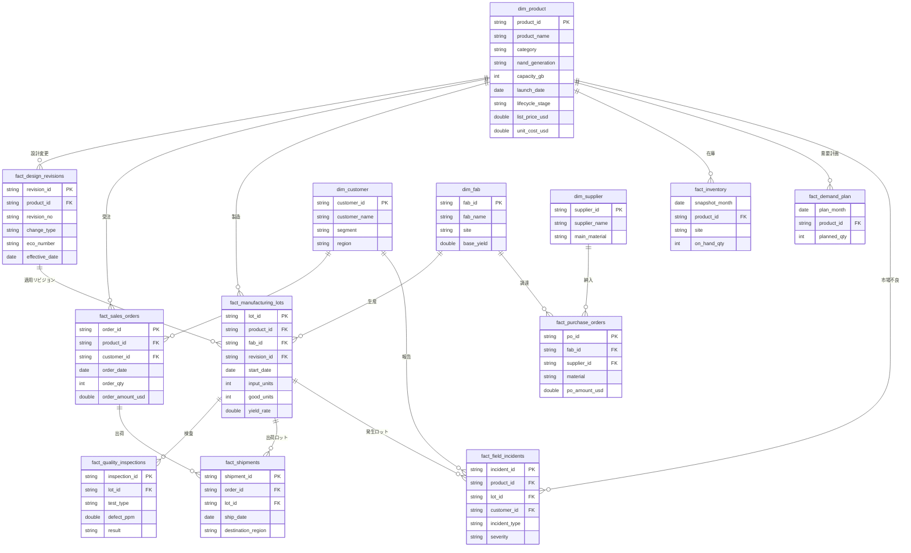

# 🧵 Digital Thread Demo — 半導体メーカー向けデジタルスレッド構想

半導体メーカーの**商品開発工程（エンジニアリングチェーン）**と**販売・調達工程（サプライチェーン）**のデータを Databricks / Unity Catalog 上で一元管理し、**デジタルスレッド**（製品 → 設計変更 → 製造ロット → 品質 → 出荷 → 顧客 → 保守 を1本の糸として追跡できる状態）を実現するデモです。

## デモ概要

| タブ | 内容 | 使用機能 |
|---|---|---|
| 📈 製品ライフサイクル分析 | AI/BIダッシュボード（2ページ）のiframe埋め込み + 製品別ライフサイクルカーブの比較 | AI/BI Dashboard, メトリクスビュー |
| 💰 収益性LTV予測 | 製品の直近実績から今後12ヶ月の残存粗利（LTV）を予測。粗利率・歩留まりのWhat-ifスライダー付き | MLflow, Unity Catalogモデル, Model Serving |
| 🌳 デジタルスレッド樹形図 | 製品→設計リビジョン(ECO)→製造ロット→出荷→顧客→市場不良のトレーサビリティをグラフ表示 | Deltaテーブル(PK/FK), Gold層ビュー |
| 🧞 Genie | 自然言語でのアドホック分析（iframe埋め込み） | AI/BI Genie |
| 🛡️ ガバナンス・環境 | UCによる統制の説明と各リソースへのリンク | Unity Catalog |

データは合成データ（NAND/SSD 50製品 × 3年、約7.7万行）。シードは固定のため `data_gen/generate.py` で再現可能です。

## 使用技術

| レイヤー | 技術 |
|---|---|
| フロントエンド | React 18 + Vite / recharts（チャート） / @xyflow/react（樹形図グラフ） |
| バックエンド | FastAPI + uvicorn / databricks-sdk（Statement Execution API・Serving呼び出し） |
| ホスティング | Databricks Apps（GitフォルダからデプロイされるPythonアプリ。ビルド済みReactを`app/static/`から配信） |
| データ基盤 | Delta Lake / Unity Catalog（PK/FK情報制約, Volume, リネージ） |
| セマンティック層 | Unity Catalog メトリクスビュー（`WITH METRICS LANGUAGE YAML`） |
| BI / NL分析 | AI/BI Dashboard（Lakeview） / AI/BI Genie |
| ML | scikit-learn (GradientBoostingRegressor) / MLflow / UC Model Registry / Model Serving（scale-to-zero） |

## アーキテクチャ



## ER図



Gold層ビュー: `v_product_monthly_pnl`（製品×月損益） / `v_product_ltv_actual`（実績LTV） / `v_lot_traceability`（デジタルスレッド連結） / `v_monthly_yield`（歩留まり）

## リポジトリ構成

```
├── app/                     # Databricks Apps（React + FastAPI）
│   ├── app.yaml             # 起動コマンド・環境変数（valueFromでリソース参照）
│   ├── main.py              # FastAPI: SQL API / LTV予測プロキシ / SPA配信
│   ├── requirements.txt
│   ├── static/              # Reactビルド成果物（コミット対象。デプロイ時にそのまま配信）
│   └── frontend/            # Reactソース（Vite）。 npm run build で ../static に出力
├── data_gen/generate.py     # 合成データ生成（seed固定）
├── sql/
│   ├── run_sql.py           # Statement Execution APIドライバ
│   ├── 01_create_tables.sql # CTAS + PK/FK + Gold層ビュー
│   └── 02_metric_views.sql  # メトリクスビュー
├── dashboard/build_dashboard.py  # AI/BIダッシュボード作成・公開
└── notebooks/train_ltv.py   # LTVモデル学習 → MLflow/UC登録
```

## リソースリンク（デモ環境）

| リソース | リンク |
|---|---|
| アプリ | https://digital-thread-demo-7405605463330453.13.azure.databricksapps.com |
| ワークスペース | https://adb-7405605463330453.13.azuredatabricks.net |
| スキーマ（カタログエクスプローラ） | [ytcy_azure_east2classic_stable.digital_thread](https://adb-7405605463330453.13.azuredatabricks.net/explore/data/ytcy_azure_east2classic_stable/digital_thread) |
| ダッシュボード | [デジタルスレッド: 製品ライフサイクル分析](https://adb-7405605463330453.13.azuredatabricks.net/dashboardsv3/01f175b94ff116d6b06fc944ca327432/published) |
| Genieスペース | [デジタルスレッド Genie](https://adb-7405605463330453.13.azuredatabricks.net/genie/rooms/01f175badff718e583cec35283ec31ee) |
| UCモデル | [ltv_predictor](https://adb-7405605463330453.13.azuredatabricks.net/explore/data/models/ytcy_azure_east2classic_stable/digital_thread/ltv_predictor) |
| サービングエンドポイント | [digital-thread-ltv](https://adb-7405605463330453.13.azuredatabricks.net/ml/endpoints/digital-thread-ltv) |
| ワークスペースGitフォルダ | [/Users/yusuke.tsuchiya@databricks.com/digital-thread](https://adb-7405605463330453.13.azuredatabricks.net/browse/folders/3732662935935402?o=7405605463330453) |

## セットアップ / デプロイ

### 1. データ基盤の構築（初回のみ）

```bash
export DATABRICKS_CONFIG_PROFILE=Azure-ytcy-east2
cd data_gen && python3 generate.py
for f in out/*.parquet; do databricks fs cp "$f" \
  "dbfs:/Volumes/ytcy_azure_east2classic_stable/digital_thread/raw/$(basename $f)" --overwrite; done
cd ../sql && python3 run_sql.py 01_create_tables.sql && python3 run_sql.py 02_metric_views.sql
cd ../dashboard && python3 build_dashboard.py     # ダッシュボード作成・公開
cd ../notebooks && python3 train_ltv.py           # モデル学習・UC登録 → Servingへデプロイ
```

### 2. フロントエンドのビルド（app/を変更した場合）

```bash
cd app/frontend && npm install && npm run build   # → app/static/ に出力（コミットする）
```

### 3. Gitフォルダ経由のアプリデプロイ

GitHubへpush後、ワークスペースのGitフォルダを最新化してデプロイします。

```bash
# Gitフォルダをpull（UIの「Pull」でも可）
databricks repos update <REPO_ID> --branch main
# Gitフォルダのapp/をソースにデプロイ
databricks apps deploy digital-thread-demo \
  --source-code-path /Workspace/Users/yusuke.tsuchiya@databricks.com/digital-thread/app
```

### ローカル開発

```bash
cd app && bash smoke_test.sh                      # バックエンドAPI一括テスト
cd app/frontend && npm run dev                    # Vite dev server（/api は :8000 にプロキシ）
```

## 注意点

- **閲覧にはワークスペースへのログインが必要**: ダッシュボード / Genie の iframe はエンドユーザー自身のワークスペースセッションで認証されます（アプリのSPではない）。
- **iframe埋め込みの承認ドメイン**: アプリのドメインをワークスペース設定の埋め込み承認ドメイン（`aibi_dash_embed_ws_apprvd_domains`）に登録済み。アプリURLが変わったら再登録が必要です。
- **アプリSPへのUC権限**: アプリのサービスプリンシパルに `USE CATALOG` / `USE SCHEMA` / `SELECT` / `EXECUTE` を付与済み。スキーマを変える場合は再GRANTが必要。ウェアハウスとServingエンドポイントの権限はアプリの**リソース設定**（作成時に定義。`app.yaml` の `resources:` は適用されない点に注意）。
- **`app/static/` はコミット対象**: Databricks Apps は Python の requirements しか解決しないため、React は事前ビルドした成果物をリポジトリに含めます。フロント変更時は `npm run build` を忘れずに。
- **Appsの.venvキャッシュ**: requirements.txt から依存を削除しても再デプロイでは残留します。クリーンにするにはアプリを stop → start。
- **Statement Execution APIの返却値は全て文字列**: フロント/バックエンドで数値変換しています。また `USE CATALOG/SCHEMA` はステートメント間で持続しないため、SQLは完全修飾名で記述しています。
- **Servingのコールドスタート**: scale-to-zero 構成のため、初回のLTV予測は数十秒かかることがあります。
- **データは全て合成データ**: 実在の企業・製品・取引を示すものではありません。モデル精度（R²≈0.99）は合成データの規則性によるもので、実データでの性能を示唆しません。
